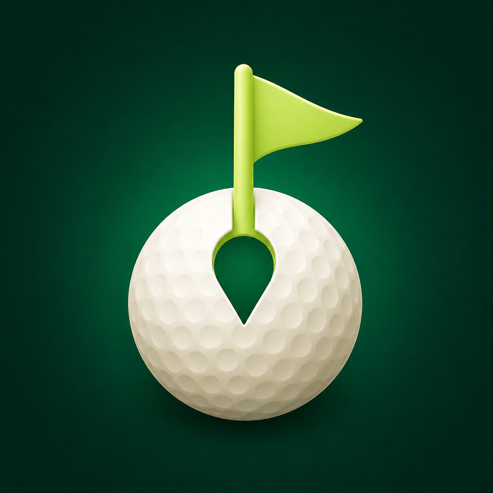

# Never Miss Golf

Get a quiet Apple Watch reminder to start Golf after arriving at a course you saved.

<p align="center">
  
</p>

## How it works

1. Save the center of one to three golf courses on the iPhone.
2. Let iOS monitor those saved regions on device.
3. After a qualifying stay, receive a local reminder on the iPhone or paired Apple Watch.
4. Choose **Open Workout**, **Not today**, or **Snooze 10 min**.
5. If you choose to continue, open Apple's built-in Workout experience and start Golf yourself.

The complete path stays local: **saved course → on-device region monitoring → local notification → user-confirmed Workout handoff**.

## Product boundary

Never Miss Golf does **not** silently start or control Apple's built-in Workout app. The reminder and handoff still require user action, and the user starts the workout inside Apple Workout.

This repository also does not create a third-party `HKWorkoutSession`, enable HealthKit, read health data, or write health data.

## Privacy model

- No account or business server.
- No analytics, advertising, or third-party SDKs.
- No location upload or continuous GPS history.
- Saved course centers stay in the app container on the iPhone.
- A maximum of three manually saved courses.
- No distance, scoring, swing analysis, or social features.

See [PRIVACY.md](PRIVACY.md) for the data boundary.

## Requirements

- iOS 17 or newer
- watchOS 10 or newer
- A paired iPhone and Apple Watch for the full notification path
- Current stable Xcode
- [XcodeGen](https://github.com/yonaskolb/XcodeGen)

## Setup

```sh
brew install xcodegen
git clone https://github.com/Lewisdai78/never-miss-golf-open-source.git
cd never-miss-golf-open-source
xcodegen generate
open NeverMissGolf.xcodeproj
```

In Xcode:

1. Select your own development team for the iOS and watchOS targets.
2. Replace `org.nevermissgolf` with a reverse-DNS namespace you control if needed.
3. Keep the iPhone and Watch bundle identifiers aligned with `WKCompanionAppBundleIdentifier`.
4. Do not add HealthKit unless you intentionally build a different product with a separately reviewed data model.

Then choose a physical paired iPhone and Apple Watch, install the apps, and follow the first-run checklist in [TESTING.md](TESTING.md).

## Verification

On Windows or PowerShell 7:

```powershell
./scripts/validate_project.ps1
./scripts/scan_public_release.ps1
```

On macOS, also generate the project and run `NeverMissGolfTests` in Xcode. Region monitoring and notification routing must be tested on real paired devices; the simulator is not sufficient evidence for the complete flow. See [TESTING.md](TESTING.md).

## Repository layout

```text
Shared/   Models, notification contract, and reminder state machine
iOS/      Local storage, permissions, region monitoring, notifications, and UI
Watch/    Watch notification entry and Workout handoff
Config/   iOS and watchOS Info.plist files
Tests/    State-machine tests
scripts/  Static privacy and publication checks
docs/     Product website source
```

## Project status

This is a non-commercial prototype and reference implementation, not a medical or safety product. Apple controls background delivery, notification routing, and the built-in Workout experience; behavior can vary with permissions, Focus, device state, connectivity, and OS versions.

The repository does not claim App Store approval or universal background-delivery guarantees.

## Contributing and security

Contributions are welcome. Read [CONTRIBUTING.md](CONTRIBUTING.md) before opening an issue or pull request. Never include real course coordinates, location history, signing material, device identifiers, or personal screenshots.

For sensitive reports, use GitHub private vulnerability reporting as described in [SECURITY.md](SECURITY.md).

## License

Licensed under the [Apache License 2.0](LICENSE). “Never Miss Golf” and its visual identity are descriptive project identifiers; the license does not grant rights to Apple trademarks or imply affiliation with Apple Inc.

Apple, iPhone, Apple Watch, and Workout are trademarks of Apple Inc. This project is independent and is not endorsed by or affiliated with Apple.

Built by [@Lewisdai78](https://github.com/Lewisdai78).
